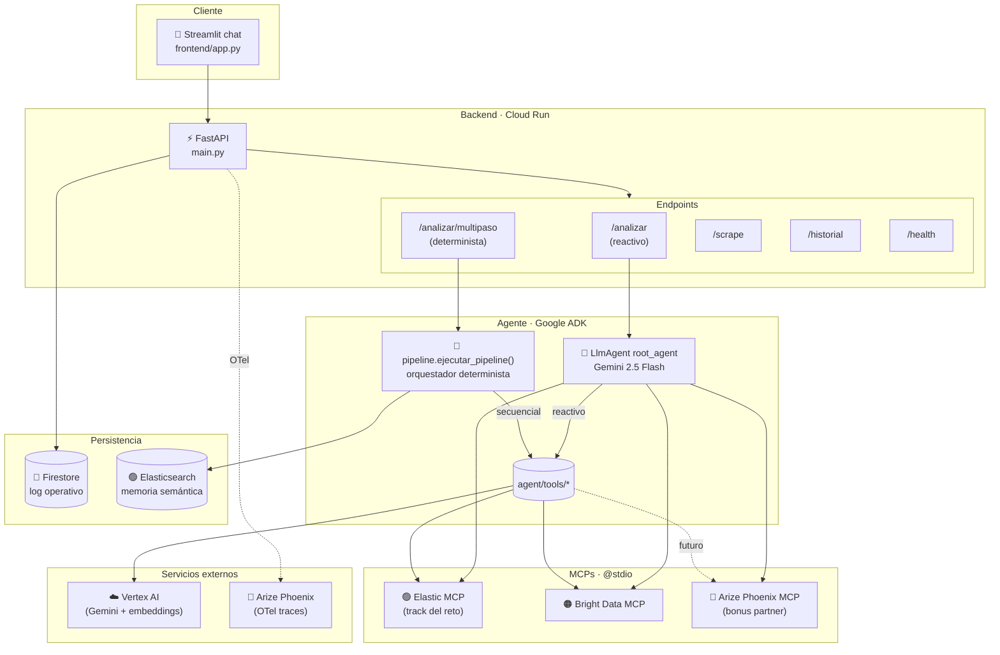
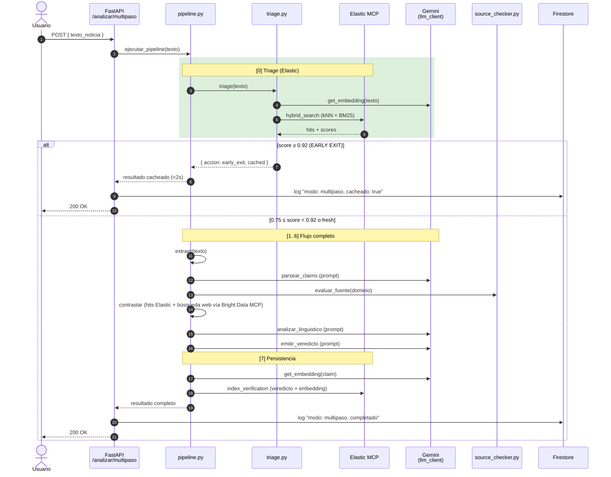
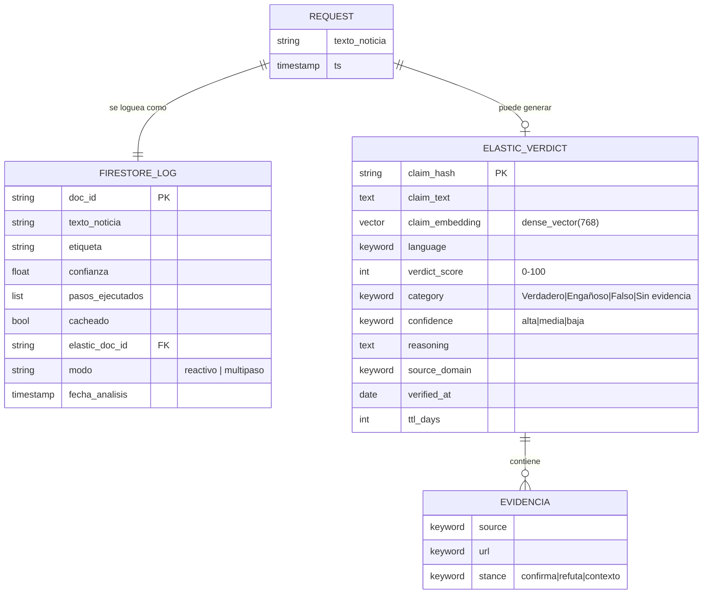
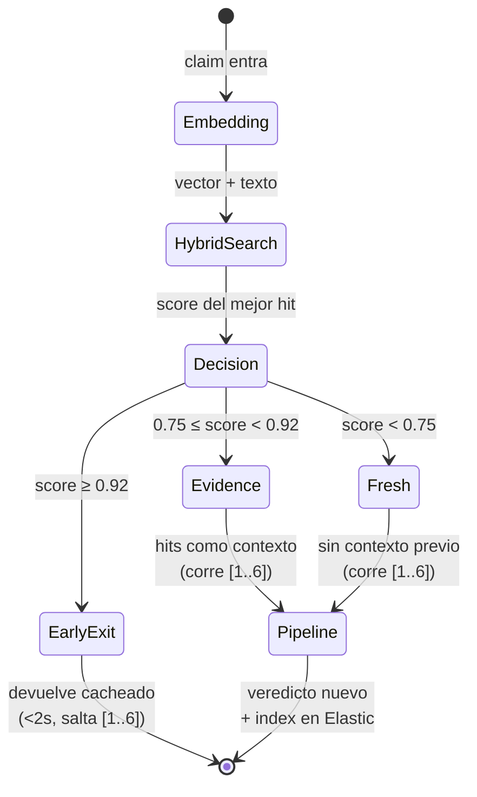
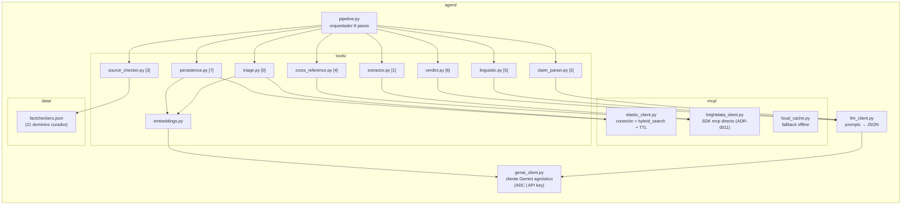
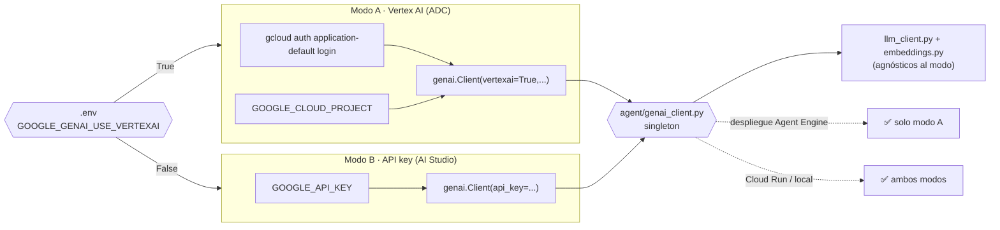

# Arquitectura — VeritasAgent

> Vista actual del sistema, con diagramas mermaid que se renderizan automáticamente en GitHub.
> Para entender **por qué** se hizo así, leer los [ADRs](adr/).

---

## 1. Vista de alto nivel

---

## 2. Flujo del endpoint `/analizar/multipaso`

El orquestador `agent/pipeline.py` ejecuta una secuencia determinista de 8 pasos.
Cada paso degrada con elegancia si falla su dependencia.

---

## 3. Modelo de datos (doble capa)

Decisión documentada en [ADR-0005](adr/0005-persistencia-doble-capa.md).

| Colección/Índice | Tecnología | Rol | Cuándo se escribe |
|---|---|---|---|
| `analisis_noticias` | Firestore | Log inmutable de cada `/analizar*` | En cada request, después del análisis |
| `verificaciones` | Firestore | Log de cada `/scrape` | En cada request a `/scrape` |
| `verified_claims` | Elasticsearch | Memoria semántica (triage + recall) | Solo en el paso [7] del pipeline cuando hay un veredicto consolidado |

---

## 4. Triage: máquina de estados

Decisión documentada en [ADR-0007](adr/0007-triage-umbrales-early-exit.md).

---

## 5. Componentes y responsabilidades

---

## 6. Autenticación a Gemini — modo dual

Decisión documentada en [ADR-0006](adr/0006-auth-gemini-dual-adc-api-key.md).

---

## 7. Configuración de entorno (resumen)

Detalles completos en `.env.example`. Aquí solo los grupos:

| Grupo | Variables clave | Para qué sirve |
|---|---|---|
| **Auth Gemini** | `GOOGLE_GENAI_USE_VERTEXAI`, `GOOGLE_CLOUD_PROJECT`, `GOOGLE_API_KEY` | Modelo y embeddings |
| **Modelos** | `MODEL_NAME`, `EMBEDDING_MODEL` | Gemini 2.5 Flash + text-embedding-004 |
| **🟢 Elastic** | `ELASTIC_API_KEY`, `ELASTIC_URL`/`ELASTIC_CLOUD_ID`, `ELASTIC_INDEX` | Track partner del reto |
| **Bright Data** | `BRIGHTDATA_API_TOKEN`, `BRIGHTDATA_WEB_UNLOCKER_ZONE` | Scraping + búsqueda |
| **Phoenix** | `API_KEY_PHOENIX`, `PHOENIX_BASE_URL` | Telemetría + bonus MCP |
| **Triage** | `TRIAGE_EARLY_EXIT_THRESHOLD`, `TRIAGE_EVIDENCE_THRESHOLD`, `CACHE_TTL_DAYS` | Umbrales semánticos |

---

## 8. Endpoints

| Método | Ruta | Modo | Cuándo usar |
|---|---|---|---|
| POST | `/analizar` | Reactivo (LlmAgent decide) | Análisis exploratorio, preguntas libres |
| POST | `/analizar/multipaso` | Determinista (pipeline.py) | Demo del reto, casos repetibles, early-exit garantizado |
| POST | `/scrape` | Bright Data MCP | Extracción de URL como markdown |
| GET | `/historial?limit=N` | Firestore | Auditoría rápida sin búsqueda semántica |
| GET | `/health` | Diagnóstico | Estado de auth, MCPs, telemetría, índices |

---

## 9. Mapa de ADRs por subsistema

| Subsistema | ADRs relevantes |
|---|---|
| Stack y orquestación | [ADR-0001](adr/0001-orquestacion-adk-agent-engine.md), [ADR-0010](adr/0010-pipeline-determinista-vs-llm-reactivo.md) |
| Producto / alcance | [ADR-0003](adr/0003-dominio-fake-news-financieras.md) |
| Datos / persistencia | [ADR-0005](adr/0005-persistencia-doble-capa.md), [ADR-0007](adr/0007-triage-umbrales-early-exit.md) |
| MCPs / partners | [ADR-0004](adr/0004-track-partner-elastic.md), [ADR-0008](adr/0008-bright-data-mcp-reemplaza-brave-fetch.md), [ADR-0009](adr/0009-arize-phoenix-bonus-partner.md), [ADR-0011](adr/0011-acceso-mcp-desde-pipeline.md) |
| Auth / despliegue | [ADR-0006](adr/0006-auth-gemini-dual-adc-api-key.md) |
| Gobernanza / proceso git | [ADR-0012](adr/0012-resolucion-merge-bright-canonica.md) |
| Legal | [ADR-0002](adr/0002-licencia-apache-2-0.md) |

---

## 10. Próximas decisiones probables (sin ADR todavía)

Estos cambios cumplen los criterios de "merecen ADR" pero aún no se han tomado:

- Cómo desplegar a **Vertex AI Agent Engine** (sesiones gestionadas vs Cloud Run plano) — incluye recrear `agent/root_agent.py` (ver ADR-0012 y Fase 6.7).
- Si convertir el `LlmAgent` reactivo en una cadena de **sub-agentes ADK secuenciales**.
- Si migrar el cliente Elastic a **async** (la implementación de `07a808b` queda como referencia).
- Política de **rotación de claves** y manejo de **Secret Manager** en producción.
- Soporte **bilingüe ES/EN** real (hoy los prompts y el pipeline operan en `es`).
